# Storage Architecture

Multi-tenant, multi-user, multi-agent state system using Azure Storage services for high-concurrency workloads.

## Core Concepts

The system manages five key entities:

- **Tenant**: Organization or workspace boundary
- **User**: Individual within a tenant
- **Agent**: Stateful agent definition and configuration
- **Run**: Single session/conversation/job executed by an agent
- **Turn/Event**: Individual messages, tool calls, or intermediate states within a run

## Architecture Overview

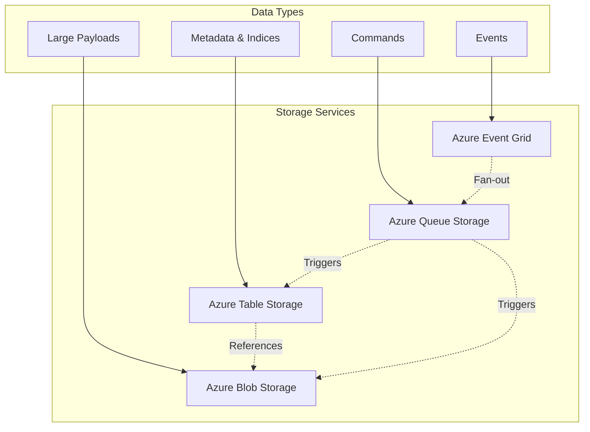
```mermaid
graph TB
    subgraph "Storage Services"
        T[Azure Table Storage]
        B[Azure Blob Storage]
        Q[Azure Queue Storage]
        E[Azure Event Grid]
    end
    
    subgraph "Data Types"
        M[Metadata & Indices]
        P[Large Payloads]
        C[Commands]
        EV[Events]
    end
    
    M --> T
    P --> B
    C --> Q
    EV --> E
    
    T -.->|References| B
    Q -.->|Triggers| T
    Q -.->|Triggers| B
    E -.->|Fan-out| Q
```

### Separation of Concerns

| Service | Purpose | Use Cases |
|---------|---------|-----------|
| **Tables** | Metadata, indices, queryable fields | Entity lookups, filtering, small data |
| **Blobs** | Large content, logs, artifacts | Transcripts, files, agent configs |
| **Queues** | Command processing, ingestion | Reliable turn processing, background jobs |
| **Event Grid** | Event notifications, fan-out | Real-time updates, integrations |

## Entity Relationship Model

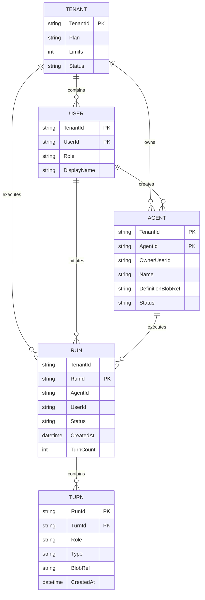
```mermaid
erDiagram
    TENANT ||--o{ USER : contains
    TENANT ||--o{ AGENT : owns
    TENANT ||--o{ RUN : executes
    USER ||--o{ AGENT : creates
    USER ||--o{ RUN : initiates
    AGENT ||--o{ RUN : executes
    RUN ||--o{ TURN : contains
    
    TENANT {
        string TenantId PK
        string Plan
        int Limits
        string Status
    }
    
    USER {
        string TenantId PK
        string UserId PK
        string Role
        string DisplayName
    }
    
    AGENT {
        string TenantId PK
        string AgentId PK
        string OwnerUserId
        string Name
        string DefinitionBlobRef
        string Status
    }
    
    RUN {
        string TenantId
        string RunId PK
        string AgentId
        string UserId
        string Status
        datetime CreatedAt
        int TurnCount
    }
    
    TURN {
        string RunId PK
        string TurnId PK
        string Role
        string Type
        string BlobRef
        datetime CreatedAt
    }
```

## Table Storage Design

### Partitioning Strategy

Optimized for high-concurrency writes and efficient queries.

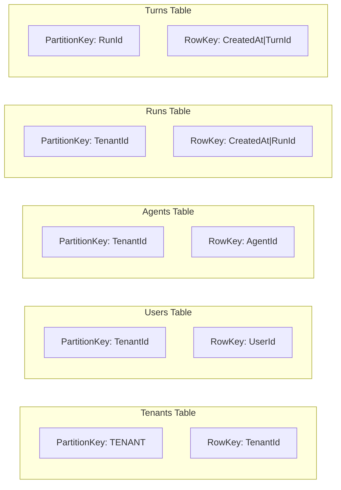
```mermaid
graph LR
    subgraph "Tenants Table"
        TP[PartitionKey: TENANT]
        TR[RowKey: TenantId]
    end
    
    subgraph "Users Table"
        UP[PartitionKey: TenantId]
        UR[RowKey: UserId]
    end
    
    subgraph "Agents Table"
        AP[PartitionKey: TenantId]
        AR[RowKey: AgentId]
    end
    
    subgraph "Runs Table"
        RP[PartitionKey: TenantId]
        RR["RowKey: CreatedAt|RunId"]
    end
    
    subgraph "Turns Table"
        TUP[PartitionKey: RunId]
        TUR["RowKey: CreatedAt|TurnId"]
    end
```

### Key Design Decisions

#### Runs Table
- **PartitionKey = TenantId**: All runs for a tenant in one partition
- **RowKey = {ISO8601Timestamp}|{RunId}**: Time-sorted for "recent runs" queries
- Enables fast "list all runs" and "filter by agent/user" within tenant
- If tenant becomes hot (>2K ops/sec), shard by hash(UserId)

#### Turns Table
- **PartitionKey = RunId**: Each run is its own partition
- **RowKey = {ISO8601Timestamp}|{TurnId}**: Chronologically ordered
- Spreads write load across many partitions (millions of runs)
- Fast sequential read of entire conversation

### Table Schema Examples

**Agents Table**:
| PartitionKey | RowKey | Name | OwnerUserId | DefinitionBlob | Status | CreatedAt |
|--------------|--------|------|-------------|----------------|---------|-----------|
| tenant-123 | agent-abc | Helper Bot | user-456 | agent-defs/... | active | 2024-01-15T... |

**Runs Table**:
| PartitionKey | RowKey | RunId | AgentId | UserId | Status | TurnCount | LastActivityAt |
|--------------|--------|-------|---------|--------|--------|-----------|----------------|
| tenant-123 | 2024-01-15T10:30:00\|run-xyz | run-xyz | agent-abc | user-456 | running | 12 | 2024-01-15T10:45:00 |

**Turns Table**:
| PartitionKey | RowKey | TurnId | Role | Type | BlobName | TokenCounts | CreatedAt |
|--------------|--------|--------|------|------|----------|-------------|-----------|
| run-xyz | 2024-01-15T10:30:00\|turn-001 | turn-001 | user | message | runs/.../turn-001.json | 150 | 2024-01-15T10:30:00 |

## Blob Storage Design

### Data Lake Layout

Hierarchical structure for analytics and lifecycle management:

```
agent-defs/
  {tenantId}/
    {agentId}.json

runs/
  {tenantId}/
    year=YYYY/
      month=MM/
        day=DD/
          {runId}/
            meta.json
            turns/
              {timestamp}_{turnId}.json

artifacts/
  {tenantId}/
    {runId}/
      {artifactId}
```

**Benefits**:
- Date-based partitioning for analytics tools
- Per-tenant prefix filtering
- Lifecycle policies by path patterns
- Easy archive/deletion by date range

### Blob Index Tags

Multi-dimensional searchable metadata on blobs:

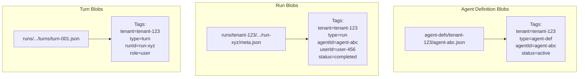
```mermaid
graph TB
    subgraph "Agent Definition Blobs"
        AD[agent-defs/tenant-123/agent-abc.json]
        ADT["Tags:<br/>tenant=tenant-123<br/>type=agent-def<br/>agentId=agent-abc<br/>status=active"]
    end
    
    subgraph "Run Blobs"
        RB[runs/tenant-123/.../run-xyz/meta.json]
        RBT["Tags:<br/>tenant=tenant-123<br/>type=run<br/>agentId=agent-abc<br/>userId=user-456<br/>status=completed"]
    end
    
    subgraph "Turn Blobs"
        TB[runs/.../turns/turn-001.json]
        TBT["Tags:<br/>tenant=tenant-123<br/>type=turn<br/>runId=run-xyz<br/>role=user"]
    end
    
    AD --> ADT
    RB --> RBT
    TB --> TBT
```

**Tag Categories**:

| Tag | Values | Purpose |
|-----|--------|---------|
| tenant | {tenantId} | Multi-tenant isolation |
| type | agent-def, run, turn, artifact | Entity classification |
| status | active, archived, completed, failed | Lifecycle state |
| agentId | {agentId} | Filter by agent |
| userId | {userId} | Filter by user |
| runId | {runId} | Aggregate turn data |
| priority | normal, high | Processing priority |

### Blob Inventory

Daily/weekly snapshots of all blobs for analytics:

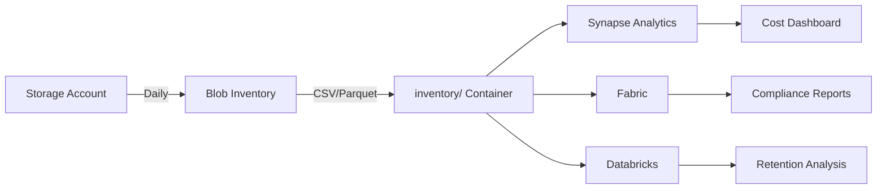
```mermaid
graph LR
    SA[Storage Account] -->|Daily| BI[Blob Inventory]
    BI -->|CSV/Parquet| IC[inventory/ Container]
    IC --> SY[Synapse Analytics]
    IC --> FA[Fabric]
    IC --> DB[Databricks]
    
    SY --> CD[Cost Dashboard]
    FA --> CR[Compliance Reports]
    DB --> RT[Retention Analysis]
```

**Use Cases**:
- Per-tenant cost attribution
- Compliance auditing
- Lifecycle policy tuning
- Storage optimization

## Queue Storage Patterns

### Command Processing

Queues ensure reliable, ordered processing under high load:

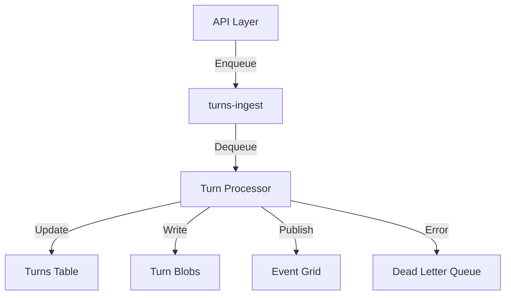
```mermaid
graph TB
    API[API Layer] -->|Enqueue| TI[turns-ingest]
    TI -->|Dequeue| TP[Turn Processor]
    TP -->|Update| TT[Turns Table]
    TP -->|Write| TB[Turn Blobs]
    TP -->|Publish| EG[Event Grid]
    
    TP -->|Error| DLQ[Dead Letter Queue]
```

**Key Queues**:
- **turns-ingest**: New turn ingestion
- **background-tasks**: Async operations (summarization, indexing)
- **dlq-turns**: Failed turn processing

**Benefits**:
- Backpressure handling (10K+ turns/sec)
- Retry logic for transient failures
- Decoupling API from processing
- At-least-once delivery guarantee

## Event Grid Integration

Event-driven architecture for real-time updates and integrations:

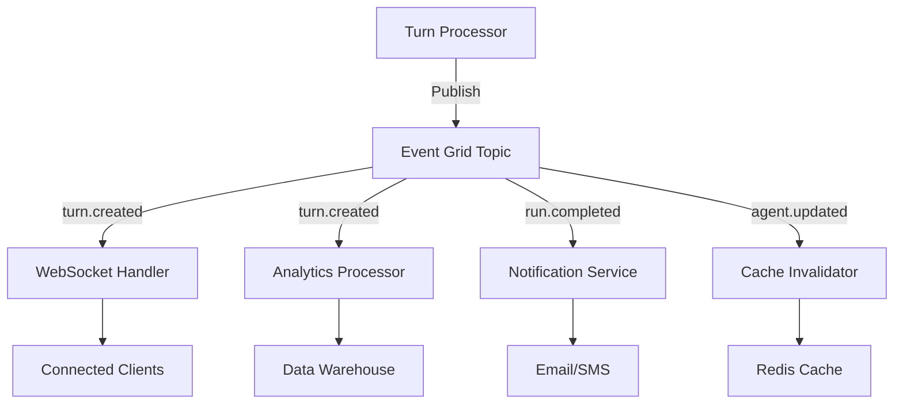
```mermaid
graph TB
    TP[Turn Processor] -->|Publish| EG[Event Grid Topic]
    
    EG -->|turn.created| WS[WebSocket Handler]
    EG -->|turn.created| AN[Analytics Processor]
    EG -->|run.completed| NT[Notification Service]
    EG -->|agent.updated| CH[Cache Invalidator]
    
    WS --> CL[Connected Clients]
    AN --> DW[Data Warehouse]
    NT --> EM[Email/SMS]
    CH --> RC[Redis Cache]
```

**Event Types**:
- `tenant.created`, `tenant.updated`
- `agent.created`, `agent.updated`, `agent.deleted`
- `run.started`, `run.completed`, `run.failed`
- `turn.created`, `turn.completed`

**Fan-out Pattern**: Single event triggers multiple independent handlers.

## Common Query Patterns

### How to Answer Common Questions

#### "List all agents for tenant X"

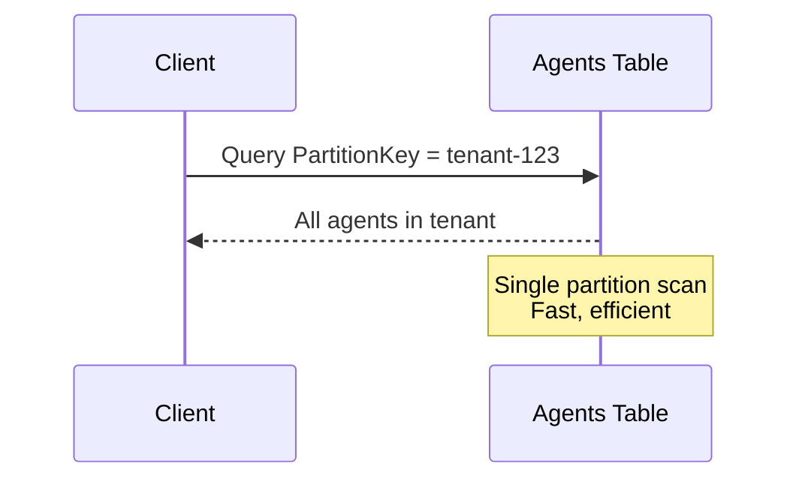
```mermaid
sequenceDiagram
    participant C as Client
    participant T as Agents Table
    
    C->>T: Query PartitionKey = tenant-123
    T-->>C: All agents in tenant
    
    Note over T: Single partition scan<br/>Fast, efficient
```

**Conceptual Approach**: Direct partition query on Agents Table.

---

#### "Show recent runs for user Y"

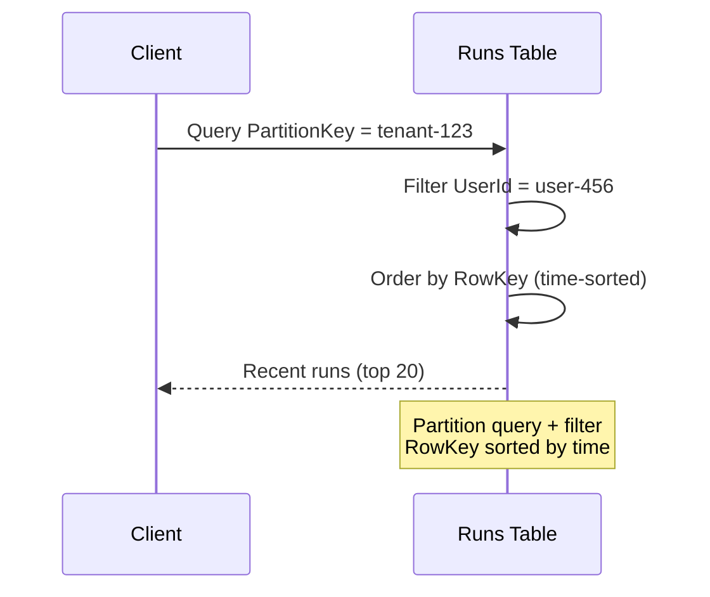
```mermaid
sequenceDiagram
    participant C as Client
    participant T as Runs Table
    
    C->>T: Query PartitionKey = tenant-123
    T->>T: Filter UserId = user-456
    T->>T: Order by RowKey (time-sorted)
    T-->>C: Recent runs (top 20)
    
    Note over T: Partition query + filter<br/>RowKey sorted by time
```

**Conceptual Approach**: Query tenant partition, filter on UserId, leverage time-sorted RowKey.

---

#### "Get full conversation for run Z"

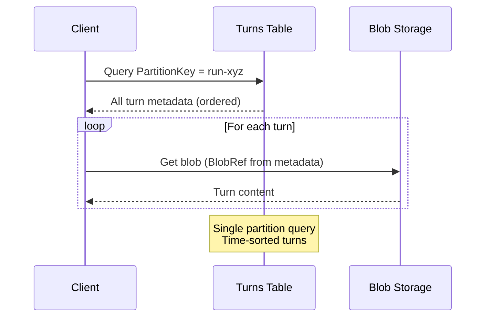
```mermaid
sequenceDiagram
    participant C as Client
    participant TT as Turns Table
    participant BS as Blob Storage
    
    C->>TT: Query PartitionKey = run-xyz
    TT-->>C: All turn metadata (ordered)
    
    loop For each turn
        C->>BS: Get blob (BlobRef from metadata)
        BS-->>C: Turn content
    end
    
    Note over TT: Single partition query<br/>Time-sorted turns
```

**Conceptual Approach**: 
1. Query Turns Table by RunId partition
2. Fetch full content from blobs using references

---

#### "Find all completed runs for agent A in last 7 days"

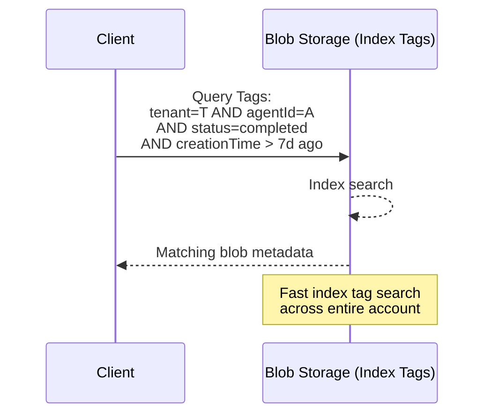
```mermaid
sequenceDiagram
    participant C as Client
    participant BS as Blob Storage (Index Tags)
    
    C->>BS: Query Tags:<br/>tenant=T AND agentId=A<br/>AND status=completed<br/>AND creationTime > 7d ago
    BS-->>BS: Index search
    BS-->>C: Matching blob metadata
    
    Note over BS: Fast index tag search<br/>across entire account
```

**Conceptual Approach**: Use blob index tags for multi-dimensional search.

---

#### "Show all turns where user said 'error'"

**Option 1 - Full-text search**:
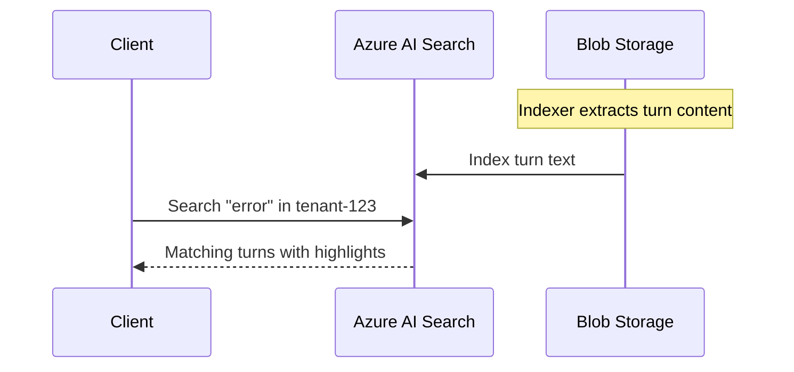
```mermaid
sequenceDiagram
    participant C as Client
    participant AI as Azure AI Search
    participant BS as Blob Storage
    
    Note over BS: Indexer extracts turn content
    BS->>AI: Index turn text
    
    C->>AI: Search "error" in tenant-123
    AI-->>C: Matching turns with highlights
```

**Conceptual Approach**: Index turn blob content in Azure AI Search for full-text queries.

**Option 2 - Table storage**:
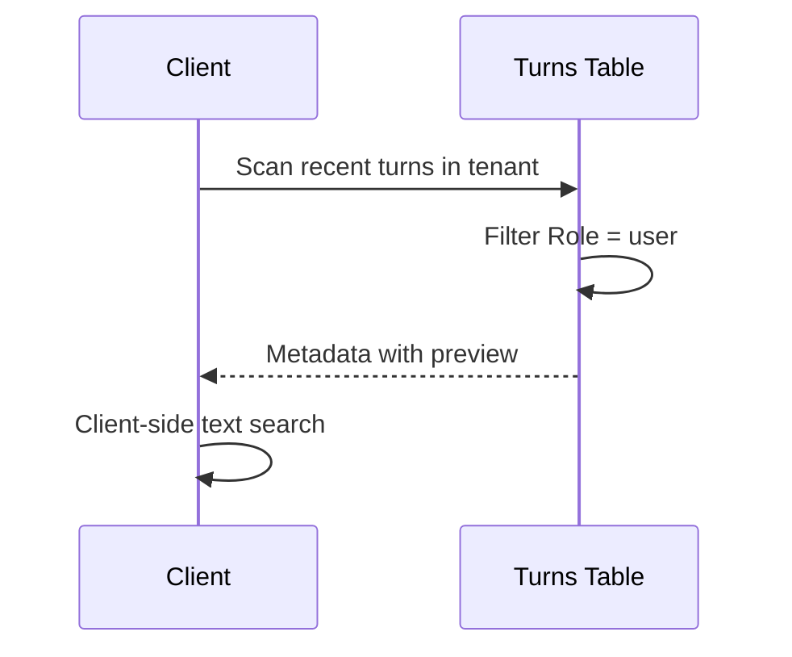
```mermaid
sequenceDiagram
    participant C as Client
    participant TT as Turns Table
    
    C->>TT: Scan recent turns in tenant
    TT->>TT: Filter Role = user
    TT-->>C: Metadata with preview
    C->>C: Client-side text search
```

**Conceptual Approach**: Store content preview in table, filter on client (for small result sets).

---

#### "Calculate total tokens used by tenant X this month"

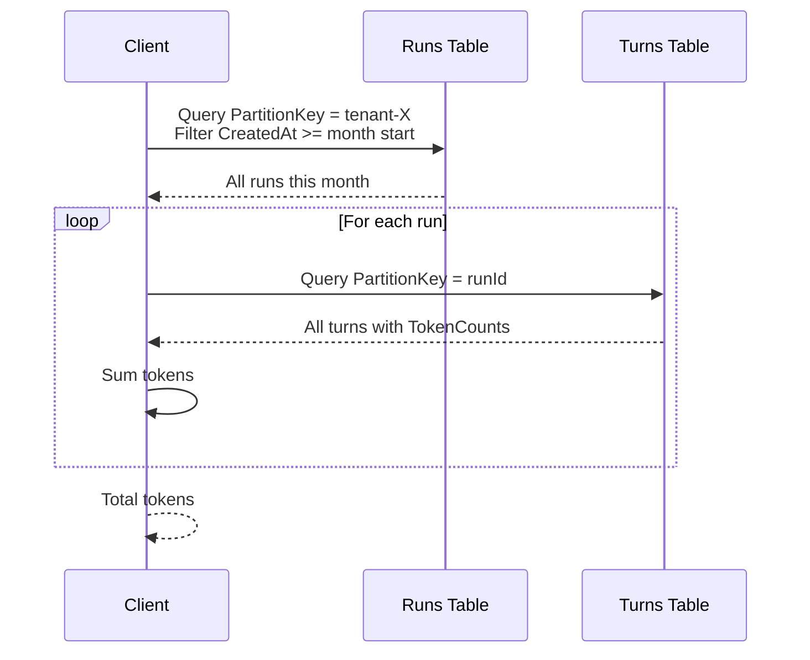
```mermaid
sequenceDiagram
    participant C as Client
    participant RT as Runs Table
    participant TT as Turns Table
    
    C->>RT: Query PartitionKey = tenant-X<br/>Filter CreatedAt >= month start
    RT-->>C: All runs this month
    
    loop For each run
        C->>TT: Query PartitionKey = runId
        TT-->>C: All turns with TokenCounts
        C->>C: Sum tokens
    end
    
    C-->>C: Total tokens
```

**Conceptual Approach**: 
1. Get runs in time range from Runs Table
2. For each run, sum TokenCounts from Turns Table
3. Alternative: Pre-aggregate in analytics pipeline

---

## Data Flow Diagrams

### Turn Ingestion Flow

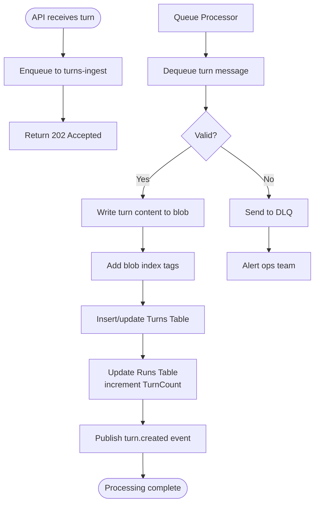
```mermaid
flowchart TD
    Start([API receives turn]) --> Q[Enqueue to turns-ingest]
    Q --> ACK[Return 202 Accepted]
    
    D[Queue Processor] --> Dequeue[Dequeue turn message]
    Dequeue --> Validate{Valid?}
    
    Validate -->|No| DLQ[Send to DLQ]
    Validate -->|Yes| WriteBlob[Write turn content to blob]
    
    WriteBlob --> Tag[Add blob index tags]
    Tag --> UpdateTable[Insert/update Turns Table]
    UpdateTable --> UpdateRun[Update Runs Table<br/>increment TurnCount]
    
    UpdateRun --> Publish[Publish turn.created event]
    Publish --> Complete([Processing complete])
    
    DLQ --> Alert[Alert ops team]
```

### Run Lifecycle Flow

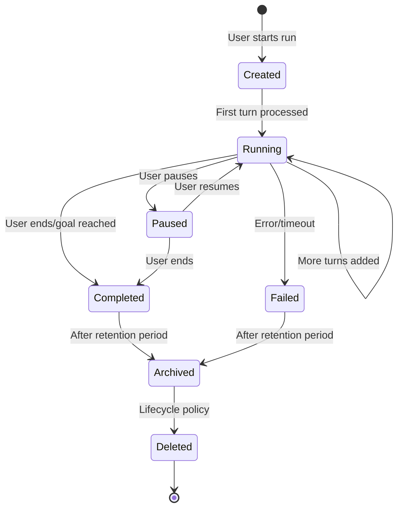
```mermaid
stateDiagram-v2
    [*] --> Created: User starts run
    Created --> Running: First turn processed
    
    Running --> Running: More turns added
    Running --> Paused: User pauses
    Running --> Completed: User ends/goal reached
    Running --> Failed: Error/timeout
    
    Paused --> Running: User resumes
    Paused --> Completed: User ends
    
    Completed --> Archived: After retention period
    Failed --> Archived: After retention period
    
    Archived --> Deleted: Lifecycle policy
    Deleted --> [*]
```

### Agent Deployment Flow

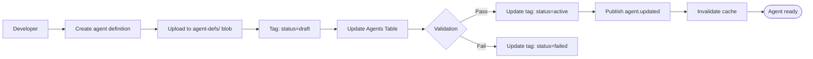
```mermaid
flowchart LR
    Dev[Developer] --> Create[Create agent definition]
    Create --> Upload[Upload to agent-defs/ blob]
    Upload --> Tag[Tag: status=draft]
    
    Tag --> Update[Update Agents Table]
    Update --> Validate{Validation}
    
    Validate -->|Pass| Promote[Update tag: status=active]
    Validate -->|Fail| Rollback[Update tag: status=failed]
    
    Promote --> Event[Publish agent.updated]
    Event --> Cache[Invalidate cache]
    Cache --> Ready([Agent ready])
```

## Data Lifecycle Management

### Conceptual Lifecycle Policies

**Hot → Cool → Archive → Delete**:

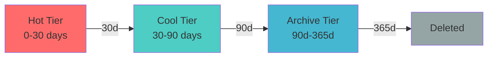
```mermaid
graph LR
    H[Hot Tier<br/>0-30 days] -->|30d| C[Cool Tier<br/>30-90 days]
    C -->|90d| A[Archive Tier<br/>90d-365d]
    A -->|365d| D[Deleted]
    
    style H fill:#ff6b6b
    style C fill:#4ecdc4
    style A fill:#45b7d1
    style D fill:#95a5a6
```

**Rules by blob type**:

| Blob Type | Hot Duration | Cool Duration | Archive Duration | Delete After |
|-----------|--------------|---------------|------------------|--------------|
| Active runs | Until completion | 30 days | 90 days | 1 year |
| Completed runs | 7 days | 30 days | 365 days | 2 years |
| Agent definitions | While active | N/A | On deprecation | Never (archive) |
| Artifacts | 30 days | 90 days | 365 days | 2 years |

**Tag-based policies**:
- Blobs tagged `status=archived` → move to archive tier
- Blobs tagged `priority=high` → retain in hot longer
- Blobs tagged `tenant={deleted-tenant}` → delete after 30 days

### Retention by Tenant

Different tenants may have different retention requirements:

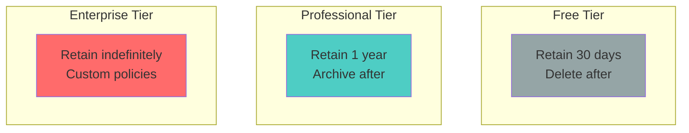
```mermaid
graph TB
    subgraph "Free Tier"
        F[Retain 30 days<br/>Delete after]
    end
    
    subgraph "Professional Tier"
        P[Retain 1 year<br/>Archive after]
    end
    
    subgraph "Enterprise Tier"
        E[Retain indefinitely<br/>Custom policies]
    end
    
    style F fill:#95a5a6
    style P fill:#4ecdc4
    style E fill:#ff6b6b
```

**Implementation**: Use blob tags `tenant={id}` and `tier={free|pro|enterprise}` in lifecycle rules.

## Analytics Integration

### Batch Analytics Pipeline

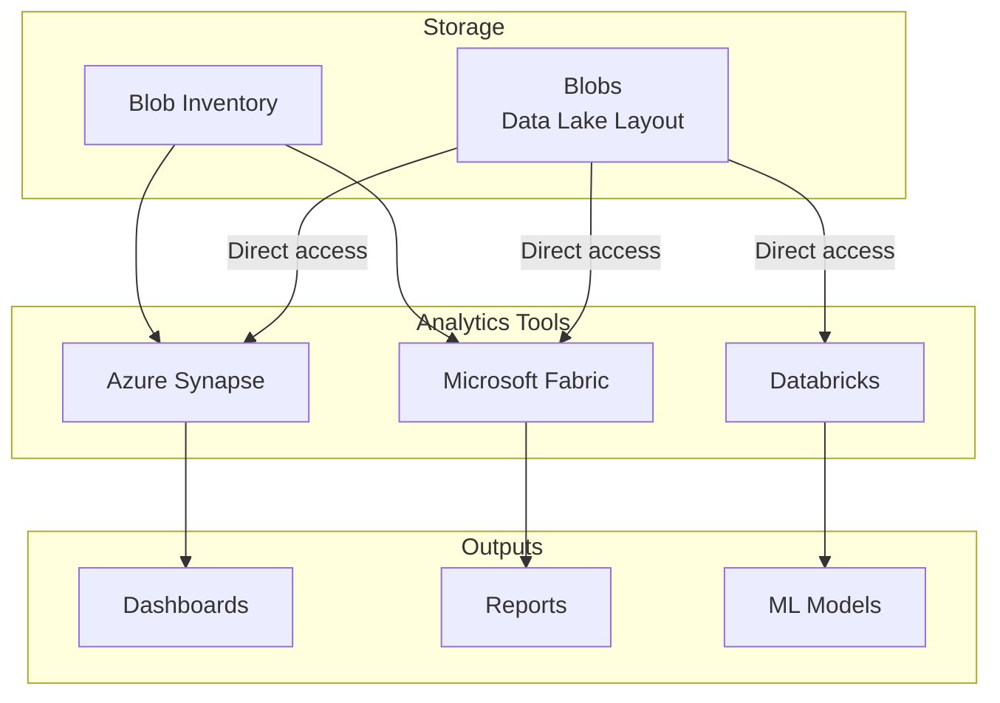
```mermaid
graph TB
    subgraph "Storage"
        BL[Blobs<br/>Data Lake Layout]
        INV[Blob Inventory]
    end
    
    subgraph "Analytics Tools"
        SY[Azure Synapse]
        FA[Microsoft Fabric]
        DB[Databricks]
    end
    
    subgraph "Outputs"
        DS[Dashboards]
        RP[Reports]
        ML[ML Models]
    end
    
    BL -->|Direct access| SY
    BL -->|Direct access| FA
    BL -->|Direct access| DB
    
    INV --> SY
    INV --> FA
    
    SY --> DS
    FA --> RP
    DB --> ML
```

**Key Patterns**:
- **Date partitioning** in blob paths enables partition pruning
- **Parquet/CSV inventory** provides metadata for cost analysis
- **External tables** in Synapse/Databricks query blobs directly
- **Incremental processing** via delta detection on blob paths

### Real-time Analytics Stream

```mermaid
graph LR
    EG[Event Grid] -->|Stream| EH[Event Hubs]
    EH --> SA[Stream Analytics]
    SA --> PBI[Power BI]
    SA --> CDB[Cosmos DB]
    
    PBI --> RT[Real-time Dashboards]
    CDB --> API[Query API]
```

**Metrics**:
- Turns per second (by tenant, agent)
- Average turn latency
- Token usage trends
- Error rates

## Scalability & Performance

### Write Scalability

**Target**: 10,000+ turns/second across all tenants

```mermaid
graph TB
    subgraph "Load Distribution"
        A[API Layer<br/>Auto-scale] --> Q1[Queue 1]
        A --> Q2[Queue 2]
        A --> Q3[Queue N]
    end
    
    subgraph "Processing"
        Q1 --> P1[Processor Pool 1]
        Q2 --> P2[Processor Pool 2]
        Q3 --> P3[Processor Pool N]
    end
    
    subgraph "Storage"
        P1 --> T1[Turns Table<br/>Partition 1]
        P2 --> T2[Turns Table<br/>Partition 2]
        P3 --> T3[Turns Table<br/>Partition N]
        
        P1 --> B1[Blob Container 1]
        P2 --> B2[Blob Container 2]
        P3 --> B3[Blob Container N]
    end
```

**Key strategies**:
- Each run = unique partition (millions of partitions)
- Queue-based backpressure
- Horizontal scaling of processors
- Blob write parallelization

### Read Optimization

**Caching layer** for frequent queries:

```mermaid
graph LR
    C[Client] --> RC[Redis Cache]
    RC -->|Cache miss| AT[Agents Table]
    RC -->|Cache miss| RT[Runs Table]
    
    AT --> RC
    RT --> RC
    RC --> C
```

**Cached items**:
- Agent definitions (high read, low write)
- Recent runs list (TTL 60s)
- User profiles

### Cost Optimization

**Storage tiers** reduce costs dramatically:

| Tier | Monthly Cost/GB | Use Case |
|------|-----------------|----------|
| Hot | $0.0184 | Active runs (0-30d) |
| Cool | $0.0100 | Recent history (30-90d) |
| Archive | $0.0018 | Long-term retention (90d+) |

**Example savings** for 1TB of data:
- All hot: $18.40/mo
- Tiered (20% hot, 30% cool, 50% archive): $7.58/mo (59% savings)

## Security & Compliance

### Multi-tenant Isolation

**Physical boundaries**:
- Table partitions by TenantId
- Blob paths prefixed by TenantId
- Blob tags include tenant identifier

**Access control**:
- Azure AD authentication
- Per-tenant SAS tokens for blob access
- Row-level security in analytics

### Audit Trail

All operations logged via Event Grid:

```mermaid
graph LR
    OP[Operations] --> EG[Event Grid]
    EG --> EH[Event Hubs]
    EH --> LA[Log Analytics]
    EH --> SI[Sentinel]
    
    LA --> QR[Query & Reports]
    SI --> AL[Security Alerts]
```

**Logged events**:
- Entity creation/modification/deletion
- Access patterns (who accessed what, when)
- Failed operations
- Lifecycle transitions

## Summary

This architecture provides:

✅ **High concurrency**: 10K+ writes/sec via partitioning  
✅ **Low cost**: Lifecycle tiers, efficient storage layout  
✅ **Reliability**: Queues, retries, dead-letter handling  
✅ **Analytics**: Data lake layout, inventory, event streams  
✅ **Multi-tenancy**: Partition isolation, cost attribution  
✅ **Flexibility**: Multiple query patterns, blob tags, search integration  

**Key Principles**:
- Tables for metadata and fast lookups
- Blobs for large content and archival
- Queues for reliable async processing
- Event Grid for real-time fan-out
- Data lake layout for analytics
- Blob tags for multi-dimensional search
- Lifecycle policies for cost optimization
